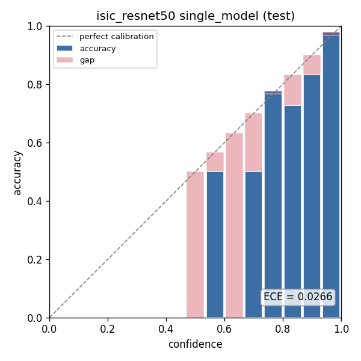
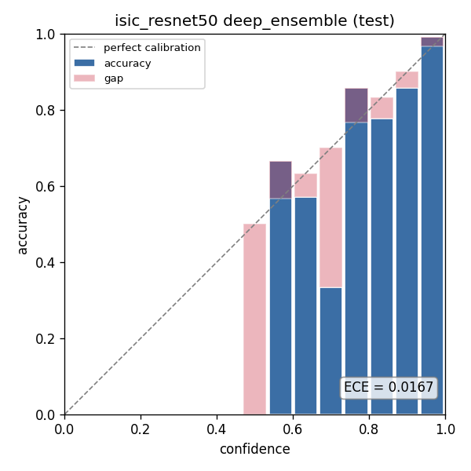
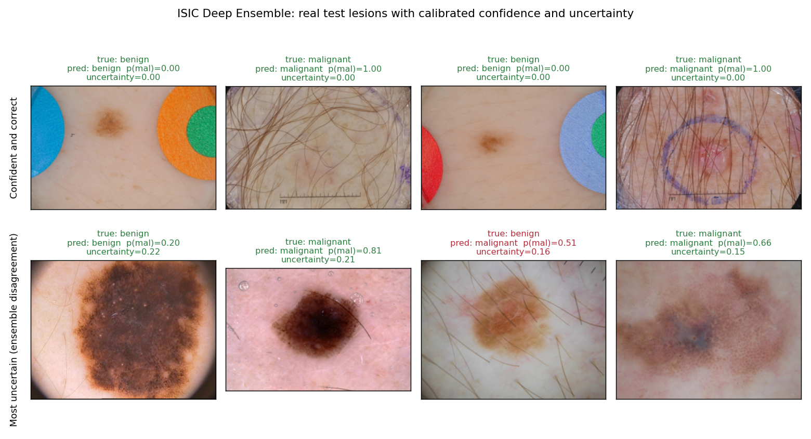
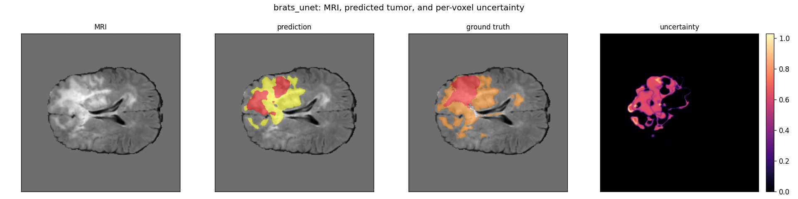

# Medical Imaging with Calibrated Uncertainty

[](https://www.python.org/)
[](LICENSE)
[](#status)

A modality-agnostic medical-imaging framework whose differentiator is calibrated uncertainty. Most medical-imaging repos report accuracy and stop. This one reports calibration alongside accuracy for every model, because a model that says how sure it is matters more in a clinical setting than one that is only sometimes right and never says so.

The uncertainty method is Deep Ensembles: train K models from different seeds and aggregate. MC Dropout is included as a cheaper comparison, so the calibration claim is a measured head-to-head rather than a single method asserted on its own. Evidential deep learning is left as future work.

One core, two applications:

- **Skin lesion classification (ISIC).** Benign vs malignant from dermoscopy images. Done.
- **Brain tumor segmentation (BraTS).** Tumor masks from multi-modal MRI, with per-voxel uncertainty maps. Done.

The model is the table stakes. The calibrated uncertainty and the reusable two-modality framework are the point.

## Design

The shared core is modality-agnostic. The two tasks differ in kind (one label per image vs one label per voxel), so a single trained model cannot do both. What transfers is everything around the model: the uncertainty engine, the calibration and evaluation suite, the training harness, and the demo shell. Task differences live behind a single data-adapter contract and a model factory.

```
src/medimg_uq/
  data/         adapters: a common (image, target, task) contract, ISIC and BraTS loaders
  models/       backbone factory: classification head or U-Net decoder
  uq/           Deep Ensembles engine and MC Dropout sampler (task-agnostic)
  calibration/  ECE, NLL, Brier, reliability diagrams, per-voxel calibration
  train/        config-driven loop: seeds, checkpointing, ensemble orchestration
  eval/         unified evaluation to a calibration report and figures
  demo/         app shell with two modes
configs/        one config per application
scripts/        download, train, and ensemble entry points
tests/          unit and smoke tests
```

Nothing in `uq/`, `calibration/`, `train/`, or `eval/` imports anything ISIC-specific or BraTS-specific. That separation is what makes the one-framework claim true. Every uncertainty method, single model included, runs through the same sampler interface, so a single model is just an ensemble of one and the numbers are directly comparable.

## Application 1: skin lesion classification (ISIC)

Binary benign vs malignant from dermoscopy images.

**Data.** 3000 images pulled from the [ISIC Archive](https://www.isic-archive.com) API, balanced 1500 benign and 1500 malignant, using the `metadata.clinical.diagnosis_1` benign/malignant label. Split into train, val, and test (70/15/15) with a seeded random stratified split, so the three sets are drawn from the same distribution. See `scripts/download_isic.py`.

**Model.** A ResNet-50 backbone (timm, ImageNet-pretrained) used as a feature extractor with an explicit dropout-plus-linear head, trained at 320 pixels. The head dropout is a real module rather than functional dropout, so MC Dropout can switch it on at inference without disturbing batch norm. The Deep Ensemble is five members trained from different seeds.

**Results (held-out test set, 450 images).**

| Method | Accuracy | AUROC | NLL | Brier | ECE |
|---|---|---|---|---|---|
| Single model | 0.942 | 0.990 | 0.165 | 0.084 | 0.027 |
| **Deep Ensemble (K=5)** | **0.951** | **0.993** | **0.118** | **0.070** | **0.017** |
| MC Dropout | 0.942 | 0.990 | 0.165 | 0.084 | 0.026 |

The Deep Ensemble is better on every metric. The accuracy and AUROC gains are small because both are near the ceiling on this data, but the calibration gains are real: the ensemble cuts NLL by 28 percent and ECE by 37 percent over the single model. That is the headline. A well-ranked model can still be overconfident, and ensembling is what fixes the confidence, not just the ordering.

MC Dropout barely moves off the single model. That is expected and worth stating plainly: dropout sits only in the classification head here, so the stochastic passes are nearly identical. Full weight diversity across independently trained members does far more than head-only dropout. If you want MC Dropout to compete, you need dropout deeper in the network.

**Calibration.** The reliability diagrams show the difference. Bars below the diagonal are overconfident bins (accuracy lags confidence).




*Left: single model, test ECE 0.027. Right: Deep Ensemble, test ECE 0.017. The ensemble's bars sit closer to the diagonal across the mid-confidence range.*

**Worked examples.** Calibrated uncertainty is only useful if the model tells you when to trust it. These are real test lesions: the top row is where the ensemble is confident and correct, the bottom row is the lesions where its members disagree most.



*Each panel shows the true label, the ensemble prediction, the probability of malignant, and the epistemic uncertainty (how much the members disagree). The uncertain row is dark, irregular pigmented lesions, the genuinely harder cases. The confident benign cases carry colored calibration stickers, a visible reminder of the dataset confounds noted below.*

**Honest caveats.**

- This is a balanced 3000-image subset drawn from the earlier, well-curated part of the archive, so it is cleaner and easier than the full ISIC collection. The high absolute AUROC reflects that, not clinical-grade performance.
- ISIC dermoscopy has known confounds (rulers, ink markings, dark vignetting) that a CNN can latch onto. These numbers should be read as a calibration demonstration, not a diagnostic claim.
- The maximum calibration error (MCE) is high for both models, but it is driven by one sparse low-confidence bin with a couple of samples. ECE, which is count-weighted, is the calibration metric to trust here.

**Reproduce.**

```
python scripts/download_isic.py --out data/isic --per-class 1500 --size full
python scripts/train_ensemble.py --config configs/isic_resnet50.yaml --data-root data/isic
```

The second command trains the five members, then scores the single model, the Deep Ensemble, and MC Dropout on val and test, writing a `comparison.json` and reliability diagrams per method.

## Demo

An interactive Gradio app: drop in a dermoscopy image and get the ensemble's calibrated benign/malignant probabilities plus how much the five members disagree. When they split, the app says so, which is the whole point of carrying uncertainty.

- Live demo: [huggingface.co/spaces/Governor6191/isic-skin-lesion-uncertainty](https://huggingface.co/spaces/Governor6191/isic-skin-lesion-uncertainty)
- Model weights: [huggingface.co/Governor6191/isic-skin-lesion-uncertainty](https://huggingface.co/Governor6191/isic-skin-lesion-uncertainty)

Run it locally:

```
uv sync --extra demo
python app.py
```

It opens at `http://127.0.0.1:7860`. By default it loads the ensemble from `checkpoints/isic_resnet50`. `app.py` and `requirements.txt` are also the Hugging Face Spaces entry point: set `MEDIMG_HF_REPO` to a model repo to pull the weights from the Hub instead of a local folder. The app carries a clear research-tool-not-a-diagnosis disclaimer.

## Application 2: brain tumor segmentation (BraTS)

Dense per-voxel tumor segmentation from multi-modal MRI (T1, T1ce, T2, FLAIR). This is the second application, and it shares the core with the classifier: the same uncertainty engine, the same calibration suite (now scored per voxel), and the same training harness. Only the model differs, a 2D-slice U-Net from `segmentation_models_pytorch` with a ResNet-34 encoder, four modalities in and four classes out (background plus the three tumor subregions). A single model is still an ensemble of one, so every method flows through one path.

**Data.** BraTS 2020, 369 patients, each four co-registered MRI volumes plus an expert segmentation. One case is dropped for a misnamed segmentation file, leaving 368. Volumes are z-scored per modality over the brain, and the tumor-bearing axial slices (24,354 of them) are extracted once to a fast on-disk cache, so training is GPU-bound rather than reloading 80 MB volumes on every access. The split is patient-level (70/15/15), so no patient's slices leak across train, val, and test. See `scripts/prepare_brats.py` and `scripts/train_brats.py`.

**Results (held-out test split, about 3,560 tumor slices, 178 million voxels).**

| Method | Dice | IoU | Voxel acc | NLL | Brier | ECE |
|---|---|---|---|---|---|---|
| Single model | 0.822 | 0.700 | 0.9926 | 0.040 | 0.0131 | 0.0059 |
| **Deep Ensemble (K=3)** | **0.828** | **0.708** | **0.9929** | **0.032** | **0.0116** | **0.0044** |

Same story as ISIC, now for dense prediction: the Deep Ensemble is better on every metric, and the calibration gains lead. Over the single model it cuts per-voxel NLL by 19 percent and ECE by 25 percent while nudging Dice and IoU up. Ensembling sharpens where the model is unsure more than it moves where the mask lands.

**Per-voxel uncertainty.** The headline figure is the test slice the ensemble found hardest, drawn as four panels: the FLAIR MRI, the predicted tumor mask, the ground truth, and the per-voxel epistemic uncertainty (how much the three members disagree).



*The uncertainty concentrates along the tumor boundary and through the heterogeneous core, exactly where the label is genuinely ambiguous, and falls to near zero in confident healthy tissue. That is what calibrated segmentation uncertainty should look like: the model flags the voxels a radiologist would also linger on.*

**Honest caveats.**

- This is a 2D-slice model, so the Dice here is not directly comparable to the 3D BraTS leaderboard, which scores whole volumes on the nested whole-tumor, tumor-core, and enhancing-tumor regions. The numbers above are the mean Dice and IoU over the three raw tumor subclasses (necrotic and non-enhancing, edema, enhancing), with background excluded.
- Training and evaluation use tumor-bearing slices only, so this measures segmentation quality given that a tumor is present, not whole-volume screening for whether one is.
- Voxel accuracy looks near-perfect because background dominates the voxel count. It is in the table for completeness; Dice, IoU, and the calibration metrics are the numbers that matter here.
- As with ISIC, MCE is noisier than ECE, since a sparse high-confidence bin can dominate it. ECE, which is count-weighted, is the calibration metric to trust.

**Reproduce.**

```
python scripts/prepare_brats.py --data-root /path/to/BraTS2020_TrainingData --out data/brats2020_slices --file-ext .nii
python scripts/train_brats.py --config configs/brats_unet.yaml --cache-dir data/brats2020_slices
```

The first command builds the slice cache once. The second trains the three members, then scores the single model and the Deep Ensemble per voxel on val and test and writes the uncertainty figure. For a different BraTS release, drop `--file-ext` for `.nii.gz` and check the modality and label naming against the adapter defaults.

## Status

Both applications are done. ISIC is deployed (demo, model, code). BraTS is trained on the real BraTS 2020 data, with per-voxel calibration and the uncertainty figure above. These are research models, not cleared diagnostic tools.

## Setup

```
uv sync --extra dev
```

Pulls the CUDA 12.4 torch wheels (built against a local RTX 4070). Drop `--extra dev` for runtime only, or add `--extra demo` / `--extra logging` for the Gradio demo and Weights and Biases logging.

Run the tests with `pytest`.

## Calibration suite

Every model reports calibration next to accuracy. For classification that is ECE, NLL, Brier, a reliability diagram, plus AUROC and accuracy. For segmentation it is the same metrics computed per voxel, plus the uncertainty map. The metric library takes probabilities and targets and knows nothing about the model or task that produced them, so the exact same code scores a classifier and a segmenter.

## Data and license

Both datasets are public and de-identified, so no IRB is required. The ISIC Archive is openly accessible; honor its terms and the per-image license. BraTS requires a data-use agreement, honored on that leg. Code is MIT, see [LICENSE](LICENSE).
